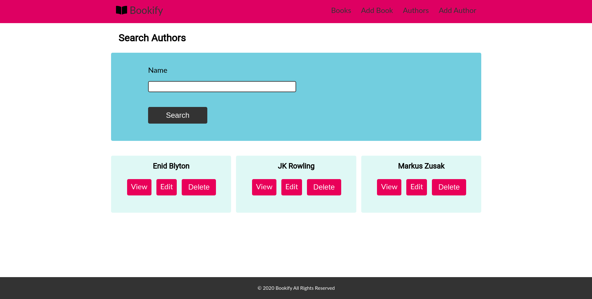

# Bookify - An Online Book Library

This is Bookify, an online book library where users can manage their books and create an online library.

# Features

1. Basic CRUD operations can be performed on Books and Authors.
2. A book library can be maintained with respective authors.
3. Supports file upload( for images ) which has been made possible by using Filepond( https://pqina.nl/filepond/ ). The images are stored on the database as they could not be stored on Heroku's server.

# Built with :

## Frontend 
1. HTML5 ( EJS has been used as a template engine )
2. CSS3
3. Javascript ( Client side for Filepond image uploads )

## Backend
1. NodeJS
2. Express
3. MongoDB 

# Screenshots

## Landing Page


## Book Gallery 


## Author Gallery


## Book Details


## Author Details


## To Run 
1. Clone into repo
2. Run ``` npm i ```
3. Run ``` npm start ```
4. Visit localhost:5000

# Live Demo 
https://bookify-app-library.herokuapp.com/
